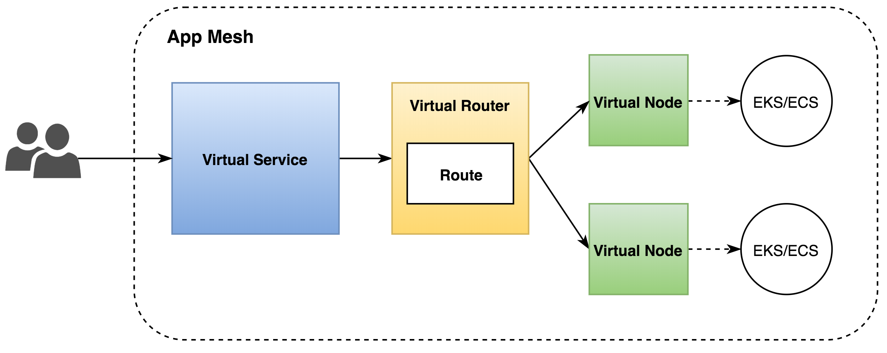

> 作者: 马若飞，lead software engineer in FreeWheel，《Istio实战指南》作者，ServiceMesher社区管委会成员。

## 前言

近两年随着微服务架构的流行，服务网格（Service Mesh）技术受到了越来越多的人的关注，并拥有了大批的拥趸。目前市面上比较成熟的开源服务网格主要有下面几个：Linkerd，这是第一个出现在公众视野的服务网格产品，由Twitter的finagle库衍生而来，Buoyant公司负责开发和维护；Envoy，Lyft开发并且是第一个从CNCF毕业的服务网格产品，定位于通用的数据平面或者单独作为Sidecar代理使用；Istio，由Google、IBM、Lyft联合开发的所谓第二代服务网格产品，控制平面的加入使得服务网格产品的形态更加完整。

服务网格技术作为构建云原生应用的重要的一环，逐渐的被越来越多的人和厂商认可，并看好它的发展前景。在Istio红得发紫的今天，作为和Google在云服务市场竞争的Amazon来说，自然不愿错失这一块巨大的蛋糕，他们在今年4月份发布了自己的服务网格产品：AWS App Mesh。本文会聚焦于Istio和App Mesh这两个产品，通过横向的对比分析让大家对它们有一个更深入的认识。

## 概念

### 产品定位

从官方的介绍来看，Istio和App Mesh都比较明确的表示自己是一种服务网格产品。Istio强调了自己在连接、安全、控制和可视化4个方面的能力；而App Mesh主要强调了一致的可见性和流量控制这两方面能力，当然也少不了强调作为云平台下的产品的好处：托管服务，无需自己维护。

从某种程度上，可以说Istio是一个重量级的解决方案，提供了不限于流量管理的其他方面的能力；而App Mesh是更加纯粹的服务于运行在AWS之上的应用并提供流控的能力。我个人认为这和它目前的产品形态还不完善有关（后面会具体提到），因此只列举了已经实现的部分。我从AWS内部了解到的信息，App Mesh应该还是一盘很大的棋，目前只是初期阶段而已。

### 核心术语

和AWS里很多产品一样，App Mesh也不是独创，而是基于Envoy开发的。AWS这样的闭环生态必然要对其产品进行封装和改进，因此在App Mesh这个产品中提出了下面几个技术术语，我们来一一介绍一下。

- 服务网格（Service mesh）：服务间网络流量的逻辑边界。这个概念比较好理解，就是为使用App mesh的服务圈一个虚拟的边界。
- 虚拟服务（Virtual services）：是真实服务的抽象。真实服务可以是部署于抽象节点的服务，也可以是简介的通过路由指向的服务。
- 虚拟节点（Virtual nodes）：虚拟节点是指向特殊工作组（task group）的逻辑指针。例如AWS的ECS服务，或者Kubernetes的Deployment。可以简单的把它理解为是物理节点或逻辑节点的抽象。
- Envoy：App Mesh里的数据平面，Sidecar代理。
- 虚拟路由器（Virtual routers）：用来处理来自虚拟服务的流量。可以理解为它是一组路由规则的封装。
- 路由（Routes）：就是路由规则，用来根据规则分发请求。

上面的图展示了这几个概念的关系：当用户请求一个虚拟服务时，服务配置的路由器根据路由策略将请求指向对应的虚拟节点，这些节点本质上是AWS里的EKS或者ECS的节点。

那么这些App Mesh自创的术语是否能在Istio中找到相似甚至相同的对象呢？我们用下面的表格做一个对比：

//todo table

## 架构

## 功能与实现方式

### 路由规则
App Mesh only supports path based routing rules. Istio, on the other hand, supports more options, including routing based on HTTP headers similar to what Application Load Balancers in AWS are now capable of. 

Another implementation difference is in the way you can set up your routing. With App Mesh you need to create a separate service for different versions, whereas with Istio you can set up a `DestinationRule` that allows you to define `subsets` you can reference from your routes. From a building perspective, the two approaches are fairly similar except for where you define the filters.

### 认证

auth：The way that access is granted to internal services is different as well. By default, Istio allows access to the services from any pod in the mesh, but you can enable RBAC and ACL controls that allow extensive [authorization settings](https://istio.io/docs/concepts/security/#authorization) including differentiation between methods (GET vs POST for example). As mentioned before, App Mesh disallows access by default so you always need to explicitly grant a Virtual Node access to a Virtual Service, but the controls are limited to allowing or disallowing access to the entire service regardless of method.
### 健康检查
While both App Mesh and Istio have support for active health checks that ensure unhealthy members of a service are taken out, Istio goes a bit further with more advanced support for various failure recovery features.
### 可观察性
//Observability data can be exported to various AWS and third-party tools, including AWS X-Ray,、、

### 日志

The other big difference, however, is in the logging. With Istio you can get the full logging and monitoring experience out of the box, including dashboards. App Mesh allows you to configure the Envoy proxy’s logging location, but afterwards you still need to run an agent that will send these logs somewhere. However, App Mesh also allows easy integration with [X-Ray](https://aws.amazon.com/xray/), AWS’ tracing service that lets you follow the path of a request across many services.

### 安全

Lastly, I want to point out one of the differences that is related to security. In Istio you can configure the mesh to use mutual TLS, which allows you to ensure all internal service requests are encrypted. App Mesh doesn’t support this yet.  （beta阶段）

### 部署形式
Istio runs entirely on your cluster with its control plane using resources in your setup, while as a hosted solution the only parts of App Mesh that use resources are the Envoy sidecars.

## 总结

//todo roadmap

//price

