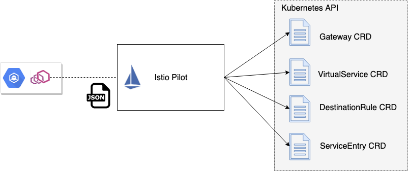
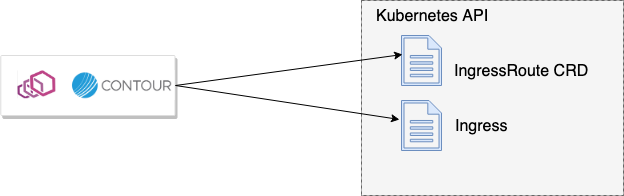
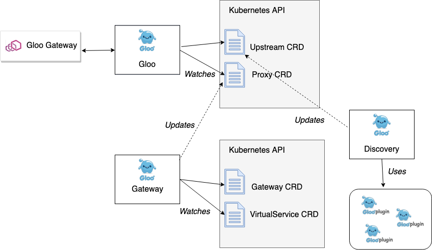

[编者按]

> 本文简要介绍了Gloo项目中用于流量控制的几个配置对象，并和Istio中相关的CRD做了对比，描述了Gloo中这些配置项的组织结构。

这是探索为Envoy构建控制平面[系列文章](https://blog.christianposta.com/envoy/guidance-for-building-a-control-plane-to-manage-envoy-proxy-based-infrastructure/) 的第3部分。

在这个系列文章中，我们研究了下面的领域：

- [采用一种机制来动态更新Envoy的路由、服务发现和其他配置](https://blog.christianposta.com/envoy/guidance-for-building-a-control-plane-to-manage-envoy-proxy-based-infrastructure/)
- [识别构成控制平面的组件，包括后端存储、服务发现API和安全控件等](https://blog.christianposta.com/envoy/guidance-for-building-a-control-plane-for-envoy-identify-components/)
- 构建最适合你的用例和组织的特定域的配置对象和API（本文）
- [考虑如何最好地使你的控制平面可插入在你需要的地方](https://blog.christianposta.com/guidance-for-building-a-control-plane-for-envoy-build-for-pluggability/)
- [部署各种控制平面组件的选项](https://blog.christianposta.com/guidance-for-building-a-control-plane-for-envoy-deployment-tradeoffs/)
- 为你的控制平面思考一个测试套件

在[前一篇](https://blog.christianposta.com/envoy/guidance-for-building-a-control-plane-for-envoy-identify-components/) ，我们评估了控制平面可能需要的组件。在本节中，我们将探索特定于域的API在你的控制平面上可能是什么样子的。

## 构建你的控制平面和API层面的交互点

一旦你考虑了哪些组件可能构成你的控制平面架构（请参阅前面的部分），你会想要确切地考虑用户将如何与控制平面交互，甚至更重要的是，*你的用户是谁？*要回答这个问题，你必须决定基于Envoy的基础架构将扮演什么角色，以及流量将如何通过你的架构。它可以是下面的组合：

- API 管理网关（北/南）
- 简单的Kubernetes边界负载均衡 / 反向代理 / 入口控制 （北/南）
- 共享的服务代理（东/西）
- 每个服务的Sidecar （东/西）

例如，Istio项目旨在成为服务网格平台，操作员可以在此基础上构建工具来驱动服务和应用程序之间的网络控制。Istio中用于配置Envoy的特定域的配置对象有以下几种：

- [Gateway](https://istio.io/docs/reference/config/istio.networking.v1alpha3/#Gateway) – 定义一个共享的代理控件（集群入口能力），指定可用于负载平衡和路由流量的协议、TLS、端口和主机/权限。
- [VirtualService](https://istio.io/docs/reference/config/istio.networking.v1alpha3/#VirtualService) – 如何与特定服务交互的规则；可以指定诸如路由匹配行为、超时、重试等。
- [DestinationRule](https://istio.io/docs/reference/config/istio.networking.v1alpha3/#DestinationRule) – 如何与特定服务进行交互的规则，包括断路、负载平衡、mTLS策略、服务的子集定义等。
- [ServiceEntry](https://istio.io/docs/reference/config/istio.networking.v1alpha3/#ServiceEntry) – 显式地将服务添加到Istio的服务注册表。

在Kubernetes中运行，所有那些配置对象被实现为[CustomResourceDefinitions](https://kubernetes.io/docs/concepts/extend-kubernetes/api-extension/custom-resources/)。

[Heptio/VMWare Contour](https://github.com/heptio/contour) 旨在作为Kubernetes的入口网关，并具有简化的特定域的配置模型，同时具有自定义资源定义 (CRD)和 [Kubernetes Ingress resource](https://kubernetes.io/docs/concepts/services-networking/ingress/)。

- [IngressRoute](https://github.com/heptio/contour/blob/master/docs/ingressroute.md) 是一个Kubernetes CRD，提供一个单一位置来指定Contour代理的配置。 
- [Ingress Resource support](https://github.com/heptio/contour/blob/master/docs/annotations.md) 允许你在Kubernetes Ingress资源上指定注解，如果你愿意这么做。

在[Gloo 项目](https://gloo.solo.io/) 中，我们决定把可用的配置对象分为两层：

- 用户用例的最佳人机工程学的面向用户的配置和可扩展性的选项（下一节将详细介绍）
- 抽象Envoy但不明确用于直接用户操作的低层配置。较高级别的对象被转换为这种较低级别的表示形式，最终用于转换为Envoy xDS API。原因将在下一节中说明。

对于用户，Gloo关注负责路由配置的团队，因为路由的语义（以及可用的转换/聚合功能）受到API和微服务开发人员的严重影响。对面向用户的API对象，我们使用：

- [Gateway](https://gloo.solo.io/v1/github.com/solo-io/gloo/projects/gateway/api/v1/gateway.proto.sk/) – 指定特定侦听器端口上可用的路由和API端点，以及每个API的安全性
- [VirtualService](https://gloo.solo.io/v1/github.com/solo-io/gloo/projects/gateway/api/v1/virtual_service.proto.sk/) – 将API路由分组到一组“虚拟API”中，它们可以路由到支持的协议（gRPC、http/1、http/2、lambda等）；让开发人员控制路由如何处理[不同的转换](https://gloo.solo.io/v1/github.com/solo-io/gloo/projects/gloo/api/v1/plugins/transformation/transformation.proto.sk/) 试图将前端API与后端中存在的API（以及后端可能引入的任何破坏性更改）解耦

注意，这些对象与它们的Istio变体不同。

Gloo中面向用户的API对象驱动较低层的对象，这些对象最终用于派生出Envoy的xDS配置。例如，Gloo的低层核心API对象是：

- [Upstream](https://gloo.solo.io/v1/github.com/solo-io/gloo/projects/gloo/api/v1/upstream.proto.sk/) – 获取后端集群和在其上面公开函数的详细信息。您可以松散地将Gloo Upstream与[Envoy 集群](https://www.envoyproxy.io/docs/envoy/latest/api-v2/api/v2/cds.proto) 关联起来，但有一个很大的区别： 一个upstream可以理解在一个特点端点的实际的服务函数（换句话说，知道`/foo/bar` 和 `/bar/wine` 以及它们期望的参数和结构，而不仅仅是`hostname:port`）。稍后再详细讲。
- [Proxy](https://gloo.solo.io/v1/github.com/solo-io/gloo/projects/gloo/api/v1/proxy.proto.sk/) – 代理是一个主要的对象，它抽象出了我们可以应用到Envoy的所有配置。这包括监听器、虚拟主机、路由和上游。更高层对象（VirtualService，Gateway等）习惯于驱动这些低层的代理对象。

Gloo控件的两层配置之间的分离允许我们在保持配置Envoy的简单抽象的同时扩展Gloo控制平面功能。本系列的第4部分将对此进行更详细的解释。

在前面的三个示例中（Istio、Contour、Gloo），每个控制平面公开一组特定域的配置对象，以用户为中心，但最终转换为Envoy配置，并通过xDS数据平面API公开。这提供了Envoy与用户的工作方式及其工作流之间的解耦。尽管我们已经看到了一些为抽象Envoy创建更关注用户和工作流的领域特定配置的例子，但这并不是构建Envoy控制平面的唯一方法。 [Booking.com 有一个非常棒的演示](https://www.slideshare.net/IvanKruglov/ivan-kruglov-introducing-envoybased-service-mesh-at-bookingcom-version-7) ，展示了如何保持与Envoy配置更接近，并使用引擎将所有不同团队的配置片段合并到实际的Envoy配置中。

除了考虑特定域的配置之外，还应该考虑API/对象模型的特定交互点。例如，Kubernetes非常关注YAML和资源文件。你可以构建一个更加特定于领域的CLI工具（像OpenShift [oc CLI](https://docs.openshift.com/enterprise/3.2/dev_guide/new_app.html#dev-guide-new-app)，Istio[istioctl](https://istio.io/docs/reference/commands/istioctl/) 以及Gloo [glooctl](https://gloo.solo.io/cli/glooctl/)）。

### Takeaway

当你构建一个Envoy控制平面时，你是带着一个特定的意图或一组架构/用户来做这件事的。应该考虑到这一点，并构建适合你的用户并改进你的Envoy操作工作流的符合人体工程学的、有主见的特定域的API。 [Gloo 团队](https://github.com/solo-io/gloo/graphs/contributors) 建议研究现有的Envoy控制平面的实现，只有在其他实现都不合适的情况下才构建自己的Envoy控制平面。Gloo的控制平面为扩展和定制奠定了基础。我们将在下一篇文章中看到，可以构建一个完全可扩展的控制平面，以适应许多不同的用户、工作流和操作约束。