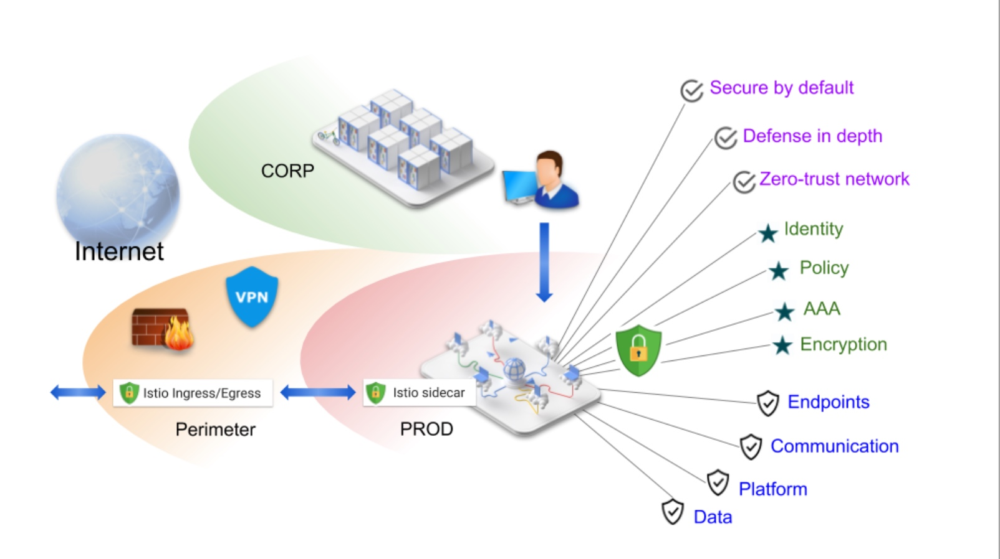
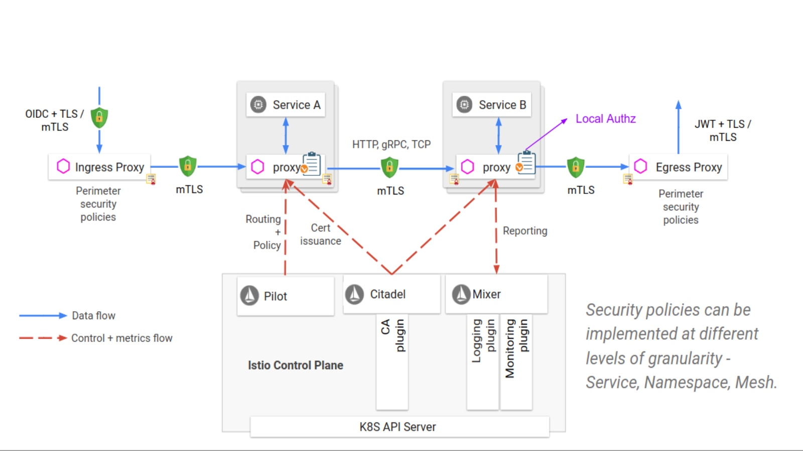
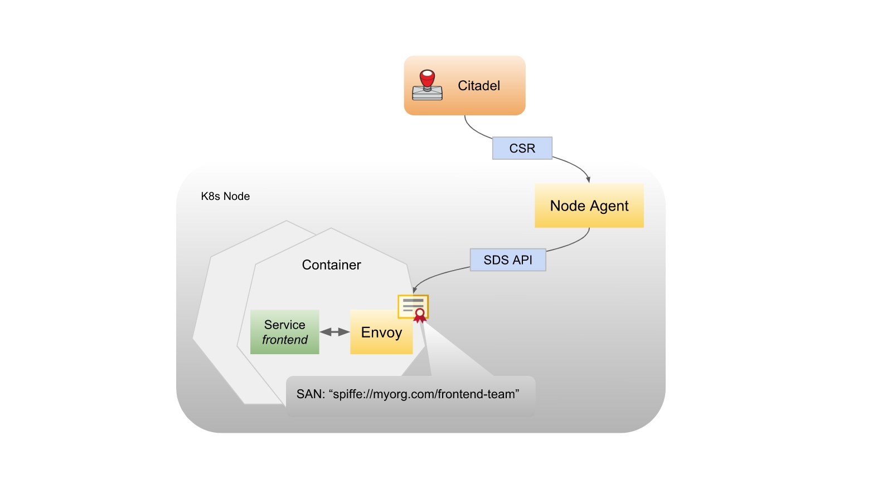
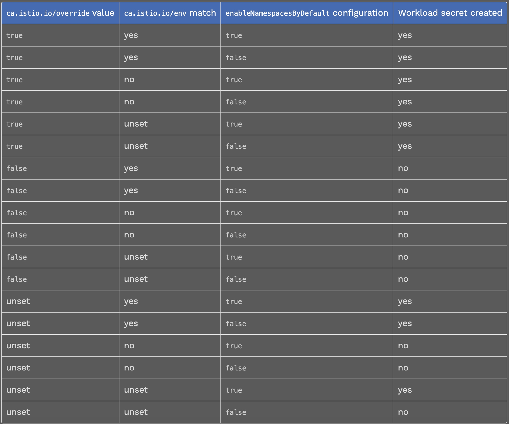
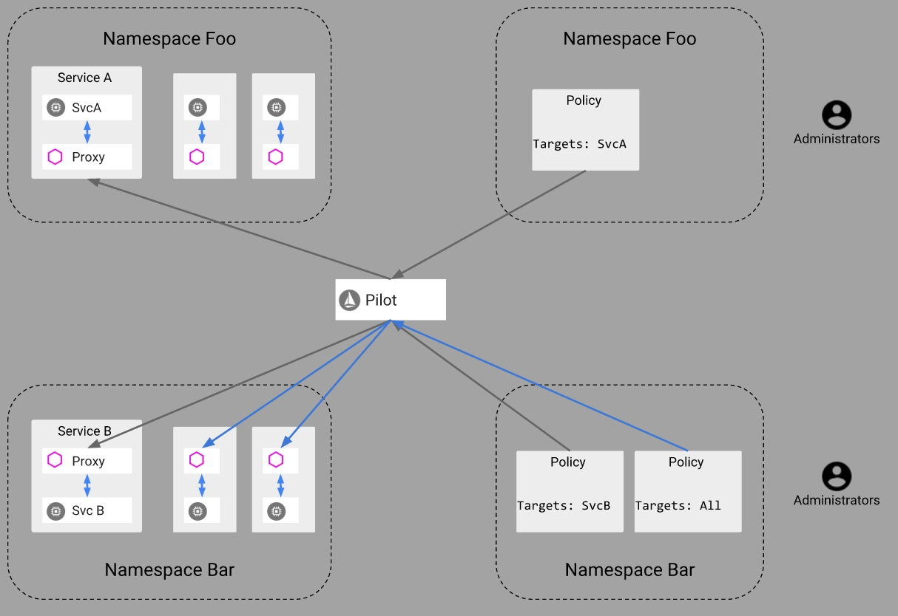
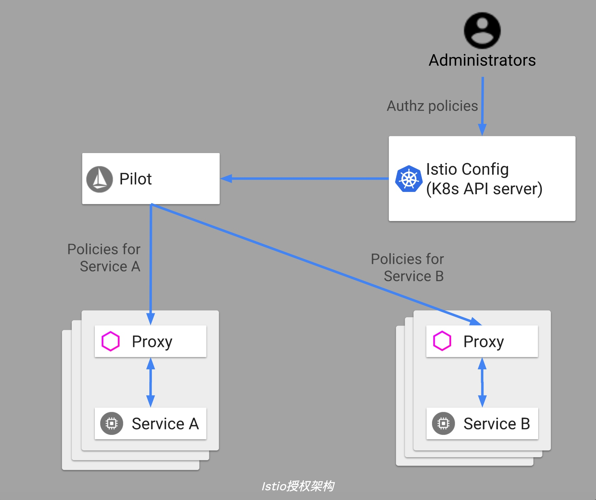

> 作者: 哗啦啦 mesh团队，热衷于kubernetes、devops、rancher、apollo、istio、linkerd2、openstack、calico 等领域技术。

## 概述

将整体应用程序分解为微服务可提供各种好处，包括更好的灵活性、更好的可伸缩性和更好的服务复用能力。但是，微服务也有特殊的安全需求：

- 为了抵御中间人攻击（man-in-the-middle attack），他们需要流量加密。
- 为了提供灵活的服务访问控制，需要双向启用TLS和细粒度的访问策略。
- 要审核谁在什么时间做了什么，他们更加需要审核工具。

`Istio Security` 试图提供全面的安全解决方案来解决所有这些问题。

此文章描述了如何使用 Istio 的安全功能来保护您的服务，无论您在何处运行它们。特别是 Istio 安全性可以减轻针对您的**数据、端点（endpoint）、通信、平台**的内部与外部的威胁。

以下是 istio 安全概述图：


Istio安全功能提供强大的身份验证、强大的策略、透明的TLS加密以及身份验证、授权和审核（AAA）工具，以保护您的服务和数据的安全。Istio安全性的目标是：

- **默认情况下启用安全性验证**：无需修改应用程序代码和基础结构
- **深度防御**：与现有安全系统集成以提供多层安全防御
- **零信任网络**：在不受信任的网络上构建安全解决方案

请访问我们的[双向 TLS 迁移](https://istio.io/docs/tasks/security/mtls-migration/)相关文章，开始在部署的服务中使用 Istio 安全功能。 请访问我们的安全任务，有关使用安全功能的详细说明。

-------
## 策略规定

Istio 允许您为应用程序配置自定义策略，以在运行时强制执行策略规则，例如：

-  速率限制以动态限制服务流量
-  启用白名单和黑名单，以限制对服务的访问
-  标头重写和重定向

Istio还允许您创建自己的[策略适配器](https://istio.io/docs/tasks/policy-enforcement/control-headers)，以添加例如自己的自定义授权行为。

您必须为 mesh 启用策略实施才能使用此功能。

-------
## 高级架构

Istio 中的安全涉及多个组件：

- **citadel** 负责密钥和证书的管理
- **sidecar 和边界代理** 负责实现客户端和服务器之间的安全通信
- Pilot 负责将 [策略认证](https://istio.io/docs/concepts/security/#authentication-policies) 和 [安全命名信息（secure naming information）](https://istio.io/docs/concepts/security/#secure-naming) 分发给代理
- mixer 负责管理授权和审计

istio 安全认证架构：


在以下各节中，我们将详细介绍 Istio 安全认证功能。

-------
## Istio 身份（identity）

身份（identity）是任何安全基础架构的基本概念。在服务到服务的通信开始时，双方必须出于相互认证的目的而将凭据与其身份信息交换凭据。在客户端，将根据[安全信息的命名](https://istio.io/docs/concepts/security/#secure-naming)检查服务器的身份，以查看其是否是该服务的授权运行程序。在服务器端，服务器可以根据[授权策略](https://istio.io/docs/concepts/security/#authorization-policy)确定客户端可以访问哪些信息，审核谁在什么时间访问了哪些信息，根据他们使用的服务向客户端收费，并拒绝任何未能支付账单的客户端访问服务。

在 Istio 身份模型中，Istio 使用一流的服务标识来确定服务的身份。 这为表示人类用户，单个服务或一组服务提供了极大的灵活性和粒度。 在没有此类身份的平台上，Istio 可以使用可以对服务实例进行分组的其他身份，例如服务名称。

不同平台上的 Istio 服务标识：

- Kubernetes: Kubernetes 服务帐户
- GKE/GCE: 可以使用 GCP 服务帐户
- GCP: GCP 服务帐户
- AWS: AWS IAM 用户/角色 帐户
- On-premises （非 Kubernetes）: 用户帐户、自定义服务帐户、服务名称、Istio 服务帐户或 GCP 服务帐户。

自定义服务帐户引用现有服务帐户，就像客户的身份目录管理的身份一样。

### Istio 安全与 SPIFFE

[SPIFFE](https://spiffe.io/)标准提供了一种框架规范，该框架能够跨环境引导和向服务发布身份。

Istio和SPIFFE共享同一身份身份文件：[SVID](https://github.com/spiffe/spiffe/blob/master/standards/SPIFFE-ID.md)（SPIFFE 可验证身份证件）。
例如，在Kubernetes中，X.509证书的URI字段格式为 spiffe://\<domain\>/ns/\<namespace\>/sa/\<serviceaccount\>，这使 Istio 服务能够建立和接受与其他 SPIFFE 兼容系统的连接。

Istio安全和[SPIRE](https://spiffe.io/spire/)，这是SPIFFE的实现，在PKI实现细节上有所不同。Istio提供了更全面的安全解决方案，包括身份验证，授权和审核。

-------
## PKI

Istio PKI 建立在 Istio Citadel 的基础上，可为每个工作负载安全地配置强身份。Istio使用X.509证书以[SPIFFE](https://spiffe.io/)格式携带身份。PKI还可以按规模自动执行密钥和证书轮换。

Istio 支持在 Kubernetes Pod和本地计算机上运行的服务，我们针对每种情况使用不同的证书密钥供应机制。

### Kubernetes场景下

1. Citadel 监视 Kubernetes `apiserver`，为每个现有和新服务帐户创建一个 SPIFFE 证书和密钥对。Citadel 将证书和密钥对存储为 [Kubernetes secrets](https://kubernetes.io/docs/concepts/configuration/secret/)。
2. 创建 Pod 时，Kubernetes 会通过 [Kubernetes secret volume](https://kubernetes.io/docs/concepts/storage/volumes/#secret) 根据其服务帐户将证书和密钥对安装到对应的 Pod。
3. Citadel 监视每个证书的有效期，并通过重写 Kubernetes secrets 自动rotates（轮换）证书。
4. Pilot 生成[安全的命名信息](https://istio.io/docs/concepts/security/#secure-naming)，该信息定义哪些服务帐户或哪些帐户可以运行特定服务。然后，Pilot 将安全命名信息传递给 Envoy sidecar。

### 本地机器方案

1. Citadel 创建了一个 gRPC 服务来接受[证书签名请求](https://en.wikipedia.org/wiki/Certificate_signing_request)（CSR）。
2. 节点代理会生成一个私钥和 CSR，然后将 CSR 及其凭据发送给 Citadel 进行签名。
3. Citadel 验证 CSR 附带的凭据，并对 CSR 签名以生成证书。
4. 节点代理将从 Citadel 收到的证书和私钥发送到 Envoy。
5. 上述CSR过程会定期重复进行证书和密钥轮换。

### Kubernetes中的节点代理

Istio 提供了使用 Kubernetes 中的节点代理进行证书和密钥供应的选项，如下图所示。请注意，在不久的将来，本地机器的身份配置流程将相似，我们仅在此处描述 Kubernetes 场景。

Kubernetes中带有节点代理的PKI：


流程如下：

1. Citadel 创建了一个 gRPC 服务来接受 CSR 请求。
2. Envoy 通过 Envoy secret 发现服务（SDS）API发送证书和密钥请求。
3. 收到 SDS 请求后，节点代理会在将 CSR 及其凭据发送给 Citadel 进行签名之前，先创建私钥和 CSR。
4. Citadel 验证 CSR 中携带的凭据，并签署 CSR 以生成证书。
5. 节点代理通过 Envoy SDS API 将从 Citadel 接收到的证书和私钥发送给 Envoy。
6. 上述 CSR 过程会定期重复进行证书和密钥轮换。

*使用节点代理调试端点（endpoint）可以查看节点代理正在主动为其客户端代理提供服务的secret，导航到 /debug/sds/workload 代理程序的端口8080以跳转到活动的工作负载 secret 或 /debug/sds/gateway 跳转到活动的网关 secret。*

-------
## 最佳实践

在本节中，我们提供一些部署指南，并讨论实际场景。

### 部署准则

如果有多个服务运维团队（又名 [SREs](https://en.wikipedia.org/wiki/Site_reliability_engineering)）在中型或大型集群中部署不同的服务，我们建议为每个 SRE 团队创建一个单独的 Kubernetes 命名空间，以隔离其访问权限。例如，您可以为一个team1团队 创建一个命名空间为team1-ns，为一个team2团队 创建一个命名空间为team2-ns，并使两个团队无法访问彼此的服务。

*如果 Citadel 受到威胁，则它在群集中的所有托管密钥和证书都可能被公开，我们强烈建议在专用命名空间中运行的citadel（例如，istio-citadel-ns），以限制只有管理员能访问。*

### 示例

让我们考虑一个带有三种服务的三层应用程序：`photo-frontend`， `photo-backend`，和 `datastore`。照片 SRE 团队管理 `photo-frontend` 和 `photo-backend` 服务，而数据存储区 SRE 团队管理 `datastore` 服务。该 `photo-frontend` 服务可以访问 `photo-backend`，并且该 `photo-backend` 服务可以访问 `datastore`，但是，该 `photo-frontend` 服务无法访问 `datastore`。

在这种情况下，群集管理员创建三个命名空间： `istio-citadel-ns`，`photo-ns`，和`datastore-ns`。管理员有权访问所有命名空间，每个团队只能访问其自己的命名空间。照片 SRE 团队创建两个服务帐户，分别在 `photo-ns` 的命名空间中运行 `photo-frontend`、 `photo-backend`。数据存储区 SRE 团队创建一个服务帐户，以在 datastore-ns 命名空间运行 datastore 服务。此外，我们需要在[Istio Mixer](https://istio.io/docs/reference/config/policy-and-telemetry/)中强制执行服务访问控制，从而使 photo-frontend 无法访问数据存储区。

在这种设置中，Kubernetes 可以隔离管理服务的操作员特权，Istio管理所有命名空间中的证书和密钥，并对服务实施不同的访问控制规则。

### Citadel如何确定是否创建服务帐户机密（Service Account secrets）

当 Citadel 实例注意到 ServiceAccount 在命名空间中创建了a时，它必须决定是否应该 istio.io/key-and-cert 为此生成一个 ServiceAccount secret，为了做出决定，Citadel 考虑了三个输入（请注意：单个群集中可以部署多个 Citadel 实例，并且以下规则应用于每个实例）：

1. `ca.istio.io/env` 命名空间标签：包含所需 Citadel 实例的名称空间的字符串值标签 
2. `ca.istio.io/override` 命名空间标签：布尔值标签，它将覆盖所有其他配置，并强制所有 Citadel 实例定位或忽略命名空间
3. `enableNamespacesByDefault`[安全配置](https://istio.io/docs/reference/config/installation-options/#security-options)：如果在ServiceAccount的命名空间上未找到标签，则为默认行为

从这三个值中，决策过程反映了详细的行为是：[Sidecar Injection Webhook](https://istio.io/docs/ops/setup/injection-concepts/)

- 如果 `ca.istio.io/override` 存在且为 true，则为工作负载生成密钥/证书机密。
- 否则，如果 `ca.istio.io/override` 存在且为 false，则不要为工作负载生成密钥/证书机密。
- 否则，如果 `ca.istio.io/env: "ns-foo"` 在服务帐户的名称空间中定义了标签，则名称空间中的 Citadel 实例 ns-foo 将用于为名称空间中的工作负载生成密钥/证书机密ServiceAccount。
- 否则，请遵循 `enableNamespacesByDefault` Helm flag，如果为true，则默认Citadel 实例将用于为 ServiceAccount 的命名空间中的工作负载生成密钥/证书机密。
- 否则，不会为 ServiceAccount 的名称空间创建任何秘密。

以下表格捕获了此逻辑：


*当命名空间从禁用转变为启用时，Citadel 将 ServiceAccounts 为该命名空间中的所有内容追溯生成secret。但是，从启用状态转换为禁用状态时，Citadel 不会删除命名空间的secret，直到更新根证书为止。*

-------
## 认证方式

Istio提供两种身份验证：

- **Transport身份验证**（也称为**服务到服务身份验证**），也称为服务到服务身份验证：验证建立连接的客户端，Istio 提供[双向TLS](https://en.wikipedia.org/wiki/Mutual_authentication) 作为用于传输身份验证的完整解决方案，您可以轻松打开此功能，而无需更改服务代码，此解决方案：

    - 为每个服务提供强大的身份，表示其角色，以实现跨群集和云的互操作性。
    - 保护服务到服务的通信和用户到服务的通信。
    - 提供密钥管理系统，以自动进行密钥和证书的生成，分发和轮换。
- **来源身份验证**（也称为**最终用户身份验证**）：将发出请求的来源客户端验证为最终用户或设备，Istio 通过 JSON Web 令牌（JWT）验证启用请求身份验证，并为开源 OpenID Connect 提供程序 [ORY Hydra](https://www.ory.sh/)、[Keycloak](https://www.keycloak.org/)、[Auth0](https://auth0.com/)、[Firebase Auth](https://firebase.google.com/docs/auth/)、[Google Auth](https://developers.google.com/identity/protocols/OpenIDConnect)和自定义身份验证提供简单明了的开发体验。

在这两种情况下，Istio 都会 `Istio config store` 通过自定义的Kubernetes API 将身份验证策略存储在其中，pilot 可以使每个代理服务器保持最新状态，并在适当时提供密钥，此外，Istio支持宽容模式下的身份验证，以帮助您了解策略更改在生效之前如何影响您的安全状况。

### 双向 TLS 认证

Istio 通过客户端和服务器端 [Envoy 代理](https://envoyproxy.github.io/envoy/) 建立服务到服务的通信通道。为了使客户端通过双向 TLS 身份验证调用服务器：

1. Istio 将来自客户端的出站流量重新路由到客户端的本地 Sidecar Envoy。
2. 客户端 Envoy 与服务器端 Envoy 开始双向TLS握手。在握手期间，客户端 Envoy 还会进行安全的命名检查，以验证服务器证书中提供的服务帐户是否有权运行目标服务。
3. 客户端 Envoy 和服务器端 Envoy 建立了双向 TLS 连接，Istio 将流量从客户端 Envoy 转发到服务器端 Envoy。
4. 授权后，服务器端 Envoy 通过本地 TCP 连接将流量转发到服务端服务。

#### 宽容模式

Istio 双向 TLS 具有宽容模式（permissive mode），该模式允许服务同时接受纯文本流量和双向TLS流量。此功能极大地改善了双向 TLS 的接入体验。

与非 Istio 服务器通信的许多非 Istio 客户端给想要将服务器迁移到启用了 TLS 的 Istio 的操作人员带来了问题，通常，操作人员无法同时为所有客户端安装 Istio Sidecar，甚至没有权限在某些客户端上安装。即使在服务器上安装了 Istio Sidecar 之后，操作员也无法在不中断现有通信的情况下启用双向 TLS。

启用宽容模式后，服务器将接受纯文本和相互TLS流量，该模式为入门提供了极大的灵活性，服务器安装的 Istio Sidecar 会立即获取双向 TLS 流量，而不会破坏现有的纯文本流量，因此，运营商可以逐步安装和配置客户端的 Istio Sidecar，以发送相互的 TLS 流量，一旦完成客户端的配置，运维人员就可以将服务器配置为仅 TLS双向模式，有关更多信息，请访问 [Mutual TLS Migration教程](https://istio.io/docs/tasks/security/mtls-migration)。

#### 安全命名

安全命名信息包含从 N 到 N 的映射，这些映射从证书中编码的服务器身份到发现服务或 DNS 引用的服务名称，从身份 A 到服务名称的映射 B 意味着 “A被允许并被授权运行服务B”，pilot 监视 Kubernetes apiserver，生成安全的命名信息，并将其安全地分发给Sidecar Envoys，以下示例说明了为什么安全命名对于身份验证至关重要。

假设运行该服务的合法服务器 datastore 仅使用 infra-team 身份，恶意用户具有用于test-team 身份的证书和密钥，恶意用户打算模拟服务以检查从客户端发送的数据，恶意用户将带有证书和 test-team 身份密钥来伪造真正服务部署到的服务器，假设恶意用户成功劫持（通过DNS欺骗，BGP/路由劫持，ARP欺骗等）发送到的流量 datastore，并将其重定向到伪造服务器上。

客户端调用 datastore 服务时，它将 test-team 从服务器的证书中提取身份，并检查是否 test-team 允许 datastore 使用安全命名信息运行，客户端检测到 test-team 是不是允许运行的 datastore 服务并且身份验证失败。

安全命名能够防止 HTTPS 流量受到一般性网络劫持，除了DNS欺骗外，它还可以保护TCP流量免受一般网络劫持。如果攻击者劫持了DNS并修改了目的地的IP地址，它将无法用于TCP通信。这是因为TCP流量不包含主机名信息，我们只能依靠IP地址进行路由，而且甚至在客户端 Envoy 收到流量之前，也可能发生DNS劫持。

### 安全认证整体架构（Authentication architecture）

您可以使用身份验证策略为在 Istio 网格中接收请求的服务指定身份验证要求，网格运算符使用 .yaml 文件来指定策略，部署后，策略将保存在 Istio 配置存储中，Istio 控制器Pilot 监视配置存储，在任何策略更改后，Pilot 都会将新策略转换为适当的配置，告诉Envoy Sidecar 代理如何执行所需的身份验证机制，pilot 可以获取公共密钥，并将其附加到配置中以进行 JWT 验证，另外 Pilot 提供了 Istio 系统管理的密钥和证书的相关路径，并将它们安装到应用程序 pod 中以实现双向 TLS。您可以在[PKI部分中](https://istio.io/docs/concepts/security/#pki)找到更多信息。Istio将配置异步发送到目标端点。代理收到配置后，新的身份验证要求将立即在该 pod 上生效。

客户端服务（发送请求的服务）负责遵循必要的身份验证机制，对于原始身份验证（JWT），应用程序负责获取 JWT 凭证并将其附加到请求里，对于双向TLS，Istio提供了[目标规则](https://istio.io/docs/concepts/traffic-management/#destination-rules)，操作人员可以使用目标规则来指示客户端代理使用 TLS 和服务器端预期的证书进行初始连接，您可以在[双向 TLS 身份验证中](https://istio.io/docs/concepts/security/#mutual-tls-authentication)找到有关 Istio 中[双向 TLS](https://istio.io/docs/concepts/security/#mutual-tls-authentication) 如何工作的更多信息。

安全认证整体架构：


Istio将身份验证与身份验证的类型以及证书中的其他声明（如果适用）一起输出到下一层：[authorization](https://istio.io/docs/concepts/security/#authorization)。运维人员可以指定将传输或来源身份验证中的哪个身份作为委托人使用。

### 认证策略（Authentication policies）

本节提供有关 Istio 身份验证策略如何工作的更多详细信息。您会从“安全认证整体架构”部分记住，身份验证策略适用于服务收到的请求。要指定双向 TLS 客户端验证规则，你需要指定 **TLSSettings** 的 **DestinationRule**。您可以在[我们的 TLS 设置参考文档中](https://istio.io/docs/reference/config/networking/v1alpha3/destination-rule/#TLSSettings)找到更多信息。与其他 Istio 配置一样，您可以在 .yaml 文件中指定身份验证策略。您可以使用命令行工具 **kubectl** 进行部署。

以下示例身份验证策略指定 **reviews** 服务的传输身份验证必须使用双向 TLS：

```yaml
apiVersion: "authentication.istio.io/v1alpha1"
kind: "Policy"
metadata:
  name: "reviews"
spec:
  targets:
  - name: reviews
  peers:
  - mtls: {}
```

#### 策略存储范围

Istio 可以在命名空间范围或网络范围存储中存储身份认证策略：

- 为 `kind` 字段指定了网格范围策略，其值为 `MeshPolicy`，名称为 `default`。例如：

```yaml
apiVersion: "authentication.istio.io/v1alpha1"
kind: "MeshPolicy"
metadata:
  name: "default"
spec:
  peers:
  - mtls: {}
```

- 为 `kind` 字段和指定的命名空间指定命名空间范围策略，其值为 `Policy`。如果未指定，则使用默认命名空间。例如，命名空间 `ns1`：

```yaml
apiVersion: "authentication.istio.io/v1alpha1"
kind: "Policy"
metadata:
  name: "default"
  namespace: "ns1"
spec:
  peers:
  - mtls: {}
```

命名空间范围存储中的策略只能影响同一命名空间中的服务。网格范围内的策略会影响网格中的所有服务。为了防止冲突和滥用，只能在网格范围存储中定义一个策略。该策略必须命名 `default` 并具有空白 `targets:` 部分。您可以在我们的目标选择器部分找到更多信息。

Kubernetes 在当前自定义资源定义（CRD）上实现 Istio 配置。这些 CRD 对应于命名空间范围和集群范围，CRDs 并通过 Kubernetes RBAC 自动继承访问保护。您可以在[Kubernetes CRD文档中](https://kubernetes.io/docs/concepts/extend-kubernetes/api-extension/custom-resources/#customresourcedefinitions)阅读更多内容。

#### 目标选择器

身份认证策略的目标指定策略适用的服务。以下示例展示的是一个 `targets:` 部分，指定该策略适用于：

- 任何端口上的 `product-page` 服务。
- 端口 `9000` 上的评论服务。

```yaml
targets:

 - name: product-page
 - name: reviews
   ports:
   - number: 9000
```

如果您未提供 `targets:` 部分，则 Istio 将策略与策略存储范围内的所有服务匹配。因此，`targets:` 部分可以帮助您指定策略的范围：

- 网格范围策略：在网格范围存储中定义的策略，没有目标选择器部分。网格中最多只能有一个网格范围的策略。
- 命名空间范围的策略：在命名空间范围存储中定义的策略，名称为 `default` 且没有目标选择器部分。每个命名空间最多只能有一个命名空间范围的策略。
- 特定于服务的策略：在命名空间范围存储中定义的策略，具有非空目标选择器部分。命名空间可以具有零个，一个或多个特定于服务的策略。

对于每项服务，Istio 都应用最短的匹配策略。顺序是：特定服务>命名空间范围>网格范围。如果多个特定于服务的策略与服务匹配，则 Istio 随机选择其中一个。运维人员在配置其策略时必须避免此类冲突。

为了强制网格范围和命名空间范围的策略的唯一性，Istio 每个网格只接受一个身份认证策略，每个命名空间只接受一个身份认证策略。Istio 还要求网格范围和命名空间范围的策略具有特定名称 `default`。

如果服务没有匹配的策略，则会禁用 Transport 身份验证和原始身份验证。

#### 传输认证

peers: 部分定义了策略中传输身份验证支持的身份验证方法和相关参数。该部分可以列出多个方法，并且只有一个方法必须满足认证才能通过。但是，从 Istio 0.7 版本开始，当前支持的唯一传输身份验证方法是双向 TLS。如果您不需要传输身份验证，请完全跳过此部分。

以下示例显示了使用双向 TLS 启用传输身份验证的 `peers:` 部分。

```yaml
peers:
  - mtls: {}
```

双向 TLS 设置具有一个可选 mode 参数，该参数定义对等 Transport 身份验证的严格性。这些模式记录在[身份验证策略参考文档](https://istio.io/docs/reference/config/istio.authentication.v1alpha1/#MutualTls-Mode)中。

默认的双向TLS模式为STRICT。因此，`mode:` STRICT等效于以下所有：
- - mtls: {}
- - mtls:
- - mtls: null

如果不指定双向 TLS 模式，则对等方无法使用 Transport 身份验证，并且 Istio 拒绝绑定到 Sidecar 的双向 TLS 连接。在应用程序层，服务仍可以处理它们自己的双向 TLS 会话。

#### 来源身份认证

origins: 部分定义了源身份验证支持的身份验证方法和相关参数。Istio 仅支持 JWT 原始身份验证。您可以指定允许的 JWT 颁发者，并为特定路径启用或禁用 JWT 身份验证。如果为请求路径禁用了所有 JWT，则身份验证也会通过，就像没有定义任何身份验证一样。与对等身份验证类似，只有一种列出的方法必须满足身份验证才能通过身份验证。

以下示例策略为原始身份验证指定了一个 `origin:` 部分，该部分接受Google发布的 JWT。路径的 JWT 身份验证 /health 已禁用。

```yaml
origins:
- jwt:
    issuer: "https://accounts.google.com"
    jwksUri: "https://www.googleapis.com/oauth2/v3/certs"
    trigger_rules:
    - excluded_paths:
      - exact: /health
```

#### 主认证绑定

主认证关系用键值对的方式存储绑定关系。默认情况下，Istio 使用 peers: 部分中配置的身份验证。如果在 peers: 部分中未配置身份验证，则 Istio 将保留身份验证。策略编写者可以使用 USE_ORIGIN 值覆盖此行为。此值将 Istio 配置为使用 origin 的身份验证作为主体身份验证。将来，我们将支持条件绑定，例如：当传输体为 X 时为 USE_PEER，否则为 USE_ORIGIN 。

以下示例显示了 principalBinding 键，其值为 USE_ORIGIN：

```yaml
principalBinding: USE_ORIGIN
```

### 更新认证策略

您可以随时更改身份认证策略，Istio 几乎实时地将更改推送到端点。但是，Istio 无法保证所有端点同时收到新策略。以下是在更新身份认证策略时避免中断的建议：

- 启用或禁用双向 TLS：使用带有 `mode:` 键和 PERMISSIVE 值的临时策略。这会将接收服务配置为接受两种类型的流量：纯文本和 TLS。因此，不会丢弃任何请求。一旦所有客户端切换到预期协议，无论是否有双向 TLS，您都可以将 PERMISSIVE 策略替换为最终策略。有关更多信息，请访问双向 TLS 的迁移。

```yaml
peers:
- mtls:
    mode: PERMISSIVE
```

- 对于 JWT 身份验证迁移：在更改策略之前，请求应包含新的 JWT。一旦服务器端完全切换到新策略，旧 JWT（如果有的话）可以被删除。需要更改客户端应用程序才能使这些更改生效。

## 授权

Istio 的授权功能也称为基于角色的访问控制（RBAC）——为 Istio 网格中的服务提供命名空间级别、服务级别和方法级别的访问控制。它的特点是：

- **基于角色的语义**，简单易用。
- **服务间和最终用户对服务的授权**。
- **通过自定义属性支持的灵活性**，例如条件、角色和角色绑定。
- **高性能**，因为 Istio 授权是在 Envoy 本地强制执行的。
- **高兼容性**，原生支持 HTTP、HTTPS 和 HTTP2，以及任意普通 TCP 协议。

### 授权架构



上图显示了基本的 Istio 授权架构。运维人员使用 .yaml 文件指定 Istio 授权策略。部署后，Istio 将策略保存在 `Istio Config Store` 中。

Pilot 监督 Istio 授权策略的变更。如果发现任何更改，它将获取更新的授权策略。 Pilot 将 Istio 授权策略分发给与服务实例位于同一位置的 Envoy 代理。

每个 Envoy 代理都运行一个授权引擎，该引擎在运行时授权请求。当请求到达代理时，授权引擎根据当前授权策略评估请求上下文，并返回授权结果 ALLOW 或 DENY。

### 启用授权

您可以使用 `RbacConfig` 对象启用 Istio Authorization。`RbacConfig` 对象是一个网格范围的单例，其固定名称值为 `default`。您只能在网格中使用一个 `RbacConfig` 实例。与其他 Istio 配置对象一样，`RbacConfig` 被定义为Kubernetes `CustomResourceDefinition`[(CRD)](https://kubernetes.io/docs/concepts/extend-kubernetes/api-extension/custom-resources/)对象。

在 `RbacConfig` 对象中，运算符可以指定 `mode` 值，它可以是：

- **OFF**：禁用 Istio 授权。
- **ON**：为网格中的所有服务启用了 Istio 授权。
- **ON_WITH_INCLUSION**：仅对包含字段中指定的服务和命名空间启用 Istio 授权。
- **ON_WITH_EXCLUSION**：除了排除字段中指定的服务和命名空间外，网格中的所有服务都启用了 Istio 授权。

在以下示例中，为 default 命名空间启用了 Istio 授权。

```yaml
apiVersion: "rbac.istio.io/v1alpha1"
kind: ClusterRbacConfig
metadata:
  name: default
spec:
  mode: 'ON_WITH_INCLUSION'
  inclusion:
    namespaces: ["default"]
```

### 授权策略

要配置 Istio 授权策略，请指定 `ServiceRole` 和 `ServiceRoleBinding`。与其他 Istio 配置对象一样，它们被定义为 Kubernetes `CustomResourceDefinition`[（CRD）](https://kubernetes.io/docs/concepts/extend-kubernetes/api-extension/custom-resources/)对象。

- `ServiceRole` 定义了一组访问服务的权限。
- `ServiceRoleBinding` 向特定主题授予 ServiceRole，例如用户、组或服务。

`ServiceRole` 和 `ServiceRoleBinding` 的组合规定：允许谁在哪些条件下做什么。明确地说：

- **谁**指的是 `ServiceRoleBinding` 中的 `subject` 部分。
- **做什么**指的是 `ServiceRole` 中的 `permissions` 部分。
- **哪些条件**指的是你可以在 `ServiceRole` 或 `ServiceRoleBinding` 中使用 Istio 属性指定的 `conditions` 部分。

#### ServiceRole

**ServiceRole** 规范包括规则、所谓的权限列表。每条规则都有以下标准字段：

- **services**：服务名称列表。您可以将值设置为 * 以包括指定命名空间中的所有服务。
- **methods**：HTTP 方法名称列表，对于 gRPC 请求的权限，HTTP 动词始终是 POST 。您可以将值设置为 * 以包含所有 HTTP 方法。
- **paths**：HTTP 路径或 gRPC 方法。 gRPC 方法必须采用 /packageName.serviceName/methodName 的形式，并且区分大小写。

`ServiceRole` 规范仅适用于 `metadata` 部分中指定的命名空间。规则中需要 `services` 和 `methods` 字段。 `paths` 是可选的。如果未指定规则或将其设置为 *，则它适用于任何实例。

下面的示例显示了一个简单的角色：`service-admin`，它可以完全访问 `default` 命名空间中的所有服务。

```yaml
apiVersion: "rbac.istio.io/v1alpha1"
kind: ServiceRole
metadata:
  name: service-admin
  namespace: default
spec:
  rules:
  - services: ["*"]
    methods: ["*"]
```

这是另一个角色：`products-viewer`，它有读取权限，包括 GET 和 HEAD，能够访问 `default` 命名空间中的 `products.default.svc.cluster.local` 服务。

```yaml
apiVersion: "rbac.istio.io/v1alpha1"
kind: ServiceRole
metadata:
  name: products-viewer
  namespace: default
spec:
  rules:
  - services: ["products.default.svc.cluster.local"]
    methods: ["GET", "HEAD"]
```

此外，我们支持规则中所有字段的前缀匹配和后缀匹配。例如，您可以在 `default` 命名空间中定义具有以下权限的 `tester` 角色：

- 完全访问前缀为 `test-*` 的所有服务，例如：`test-bookstore`、`test-performance`、`test-api.default.svc.cluster.local`。
- 读取（GET）使用 `*/reviews` 后缀访问的所有路径，例如：在 `bookstore` `.default.svc.cluster.local` 服务中的 `/books/reviews`、`/events/booksale/reviews`、`/reviews`。

```yaml
apiVersion: "rbac.istio.io/v1alpha1"
kind: ServiceRole
metadata:
  name: tester
  namespace: default
spec:
  rules:
  - services: ["test-*"]
    methods: ["*"]
  - services: ["bookstore.default.svc.cluster.local"]
    paths: ["*/reviews"]
    methods: ["GET"]
```

在 `ServiceRole` 中，`namespace + services + paths + methods` 的组合定义了**如何访问服务**。在某些情况下，您可能需要为规则指定其他条件。例如，规则可能仅适用于服务的某个**版本**，或仅适用于具有特定**标签**的服务，如 `foo`。您可以使用 `constraints` 轻松指定这些条件。

例如，下面的 `ServiceRole` 定义在以前的 `products-viewer` 角色基础之上添加了一个约束：`request.headers[version]` 为 v1 或 v2 。在[约束和属性页面](https://istio.io/docs/reference/config/authorization/constraints-and-properties/)中列出了约束支持的 `key` 值。在属性值是 map 类型的情况下，例如 `request.headers`，`key` 是 `map` 中的一个条目，例如 `request.headers[version]`。

```yaml
apiVersion: "rbac.istio.io/v1alpha1"
kind: ServiceRole
metadata:
  name: products-viewer-version
  namespace: default
spec:
  rules:
  - services: ["products.default.svc.cluster.local"]
    methods: ["GET", "HEAD"]
    constraints:
    - key: request.headers[version]
      values: ["v1", "v2"]
```

#### ServiceRoleBinding

`ServiceRoleBinding` 规范包括两部分：

- **roleRef** 指的是同一命名空间中的 `ServiceRole` 资源。
- **subjects** 分配给角色的列表。

您可以使用 `user` 或一组 `properties` 显式指定 *subject*。`ServiceRoleBinding subject` 中的 `property` 类似于 `ServiceRole` 规范中的 *constraint*。 `property` 还允许您使用条件指定分配给此角色的一组帐户。它包含一个 `key` 及其允许的*值*。约束支持的 key 值列在[约束和属性页面](https://archive.istio.io/v1.2/zh/docs/reference/config/authorization/constraints-and-properties/)中。

下面的例子显示了一个名为 `test-binding-products` 的 `ServiceRoleBinding`，它将两个 `subject` 绑定到名为 `product-viewer` 的 `ServiceRole` 并具有以下 `subject`

- 代表服务 a 的服务帐户，`service-account-a`。
- 代表 `Ingress` 服务的服务帐户 `istio-ingress-service-account` 并且 它的 JWT 中的 `mail` 项声明为 `a@foo.com`。

```yaml
apiVersion: "rbac.istio.io/v1alpha1"
kind: ServiceRoleBinding
metadata:
  name: test-binding-products
  namespace: default
spec:
  subjects:
  - user: "service-account-a"
  - user: "istio-ingress-service-account"
    properties:
      request.auth.claims[email]: "a@foo.com"
    roleRef:
    kind: ServiceRole
    name: "products-viewer"
```

如果您想要公开访问服务，可以将 `subject` 设置为 `user："*"` 。此值将 `ServiceRole` 分配给所有（经过身份验证和未经身份验证的）用户和服务，例如：

```yaml
apiVersion: "rbac.istio.io/v1alpha1"
kind: ServiceRoleBinding
metadata:
  name: binding-products-allusers
  namespace: default
spec:
  subjects:
  - user: "*"
    roleRef:
    kind: ServiceRole
    name: "products-viewer"
```

要将 `ServiceRole` 分配给经过身份验证的用户和服务，请使用 `source.principal："*"` 代替，例如：

```yaml
apiVersion: "rbac.istio.io/v1alpha1"
kind: ServiceRoleBinding
kind: ServiceRoleBinding
metadata:
  name: binding-products-all-authenticated-users
  namespace: default
spec:
  subjects:
  - properties:
      source.principal: "*"
    roleRef:
    kind: ServiceRole
    name: "products-viewer"
```

### 在普通 TCP 协议上使用 Istio 认证

[Service role](https://archive.istio.io/v1.2/zh/docs/concepts/security/#servicerole) 和 [Service role binding](https://archive.istio.io/v1.2/zh/docs/concepts/security/#servicerolebinding) 中的例子展示了在使用 HTTP 协议的 service 上使用 Istio 认证的典型方法。在那些例子中，`service role` 和 `service role binding` 里的所有字段都可以支持。

Istio 授权支持使用任何普通 TCP 协议的 service，例如 MongoDB。在这种情况下，您可以像配置 HTTP 服务一样配置 `service role` 和 `service role binding`。不同之处在于某些字段，约束和属性仅适用于 HTTP 服务。这些字段包括：

- **service role** 配置对象中的 `paths` 和 `methods` 字段。
- **service role binding** 配置对象中的 `group` 字段。

支持的约束和属性在[约束和属性页面](https://archive.istio.io/v1.2/zh/docs/reference/config/authorization/constraints-and-properties/)中列出。

如果您在 `TCP service` 中使用了任意 HTTP 独有的字段，Istio 将会完全忽略 `service role` 或 `service role binding` 自定义资源，以及里面设置的策略。

假设您有一个 `MongoDB service` 在 `27017` 端口上监听，下面的示例配置了一个 `service role` 和一个 `service role binding`，仅允许 Istio 网格中的 `bookinfo-ratings-v2` 访问 `MongoDB service`。

```yaml
apiVersion: "rbac.istio.io/v1alpha1"
kind: ServiceRole
metadata:
  name: mongodb-viewer
  namespace: default
spec:
  rules:
  - services: ["mongodb.default.svc.cluster.local"]
    constraints:
    - key: "destination.port"
      values: ["27017"]
---
apiVersion: "rbac.istio.io/v1alpha1"
kind: ServiceRoleBinding
metadata:
  name: bind-mongodb-viewer
  namespace: default
spec:
  subjects:
  - user: "cluster.local/ns/default/sa/bookinfo-ratings-v2"
  roleRef:
    kind: ServiceRole
    name: "mongodb-viewer"
```

### 授权宽容模式

授权宽容模式（authorization permissive mode）是 Istio 1.1 发布版中的实验特性。其接口可能在未来的发布中发生变化。

授权宽容模式允许您在将授权策略提交到生产环境部署之前对其进行验证。

您可以在全局授权配置和单个独立策略中启用授权宽容模式。如果在全局授权配置中设置，所有策略都将切换至授权宽容模式，不管其本身的模式。如果您设置全局授权模式为 ENFORCED，单个策略设置的强制模式将起作用。如果您没有设置任何模式，全局授权配置和单个策略都将默认被设置为 ENFORCED。

要全局启用宽容模式，请将全局 `Istio RBAC` 授权配置中的 `enforcement_mode`: 设置为 `PERMISSIVE`，如下面的示例所示。

```yaml
apiVersion: "rbac.istio.io/v1alpha1"
kind: ClusterRbacConfig
metadata:
  name: default
spec:
  mode: 'ON_WITH_INCLUSION'
  inclusion:
    namespaces: ["default"]
  enforcement_mode: PERMISSIVE
```

如要为特定策略启用宽容模式，请将策略配置文件中的 mode: 设置为 PERMISSIVE，如下面的示例所示。

```yaml
apiVersion: "rbac.istio.io/v1alpha1"
kind: ServiceRoleBinding
metadata:
  name: bind-details-reviews
  namespace: default
spec:
  subjects:
    - user: "cluster.local/ns/default/sa/bookinfo-productpage"
  roleRef:
    kind: ServiceRole
    name: "details-reviews-viewer"
  mode: PERMISSIVE
```

### 使用其他授权机制

虽然我们强烈建议使用 Istio 授权机制，但 Istio 足够灵活，允许您通过 Mixer 组件插入自己的身份验证和授权机制。 要在 Mixer 中使用和配置插件，请访问我们的[策略和遥测适配器文档](https://archive.istio.io/v1.2/zh/docs/concepts/policies-and-telemetry/#%E9%80%82%E9%85%8D%E5%99%A8)。


